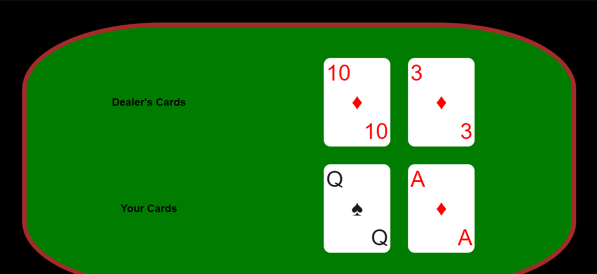

<h1 align="center">Blackjack</h1>

 

Come play one of the most popular card games today. Play your odds to see if you have luck on your side. 
Game Objective: Get your cards as close to 21 without going over, while also having a higher count than the dealer.
 
Rules:
 
  1) Card Count: All numbered cards equate to the number that they show. Face cards such as Jack, Queen and King all Equate to 10. Ace is your savior card. It will equate to 11 or 1 depending on what your score is. If you go over 21 and you have an Ace, it drops to 1. If you have a face card and an ace. Congrats, you got blackjack.
 
  2) Once the initial cards are dealt. You have the option to Hit, or to Stay. If you choose to Hit, you are given a random card out of the deck. This card is added to your total. If you go over 21, you bust and lose the round. If you choose to stay, the dealer has the choice to Hit or to stay.
 
  3) Once both decide to stay, the value of the cards are determined and the player closest to 21 without going over wins.Tie always goes to the dealer. If you both have a card count of 20. The dealer wins.

 

# Technologies used
This project was created with:
* React
* React-Router
* JavaScript
* JSX
* Styled Components
* CSS

# Deployed Site:
https://austdobe.github.io/blackJack/

# Future Development Considerations:

1. Add ability to bet at the start of each hand, and keep track of the players wallet.

2. Add a score board to keep track of wins and losses.

3. Create a more responsive and intelligent AI dealer.

4. Add online capabilities to allow other to play in the same game against the dealer.

# Developer
* Austin Dober | https://github.com/austdobe

